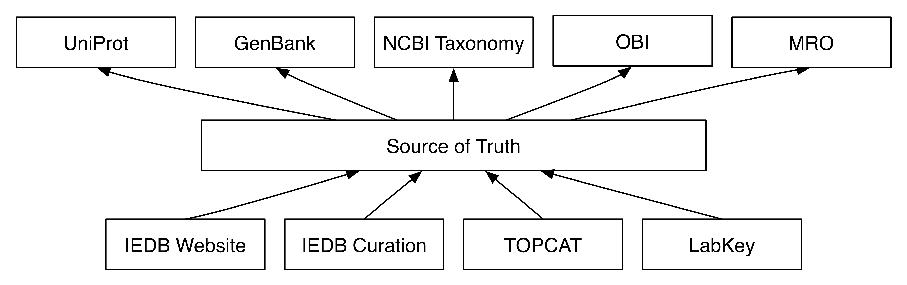

Many valuable community resources are available for describing immunology experiments and results, including:
[UniProt](http://www.uniprot.org),
[GenBank](https://www.ncbi.nlm.nih.gov/genbank/),
[the NCBI Taxonomy](https://www.ncbi.nlm.nih.gov/taxonomy),
[the Ontology for Biomedical Investigations](http://obi-ontology.org),
[the MHC Restriction Ontology](https://github.com/IEDB/MRO),
and many more.
By using standardized terminology from these community resources we make our data much easier to validate, share, reuse, search, and analyze.

These community resources are designed to be useful to the widest audience, but we know that every scientific project is unique. No matter how excellent these resources are, they will never be a perfect match for the needs of a given project:

- they include too much, but there's always something missing
- they change too slowly, but they don't change quickly enough

Source of Truth (SoT) is designed to solve these problems by introducing a layer of control between the community resources and individual projects. It provides a website for finding the term you want or requesting a new term, and a REST API for fetching and updating lists of terms.

At the [La Jolla Institute for Allergy and Immunology](http://www.lji.org) (LJI), our planned use of SoT looks something like this:

See <https://ontology.iedb.org>.

## Using SoT at LJI

If you are at LJI and want to make use of our SoT for your project, you should follow these steps:

1. collect a list of terms that you are using in your project
2. create a mapping from your private identifiers to the public identifiers used by SoT
3. query SoT using the public identifiers to get information about your terms

SoT uses [IRIs](https://en.wikipedia.org/wiki/Internationalized_Resource_Identifier) for all public identifiers. IRIs can be shortened to [CURIEs](https://en.wikipedia.org/wiki/CURIE) using a prefix. If you need a term that's not available in SoT, you can [request it](mailto:james@overton.ca) -- currently this is a manual process. We will either import the term from a community resource, or create a new ONTIE term.

The [API documentation](docs/api.html) explains how to query for terms.

You should periodically query SoT with your list of terms to see if any of the terms have been updated or replaced. Our general goal is to replace ONTIE terms with term from a community resource, but we will maintain ONTIE term identifiers indefinitely.
